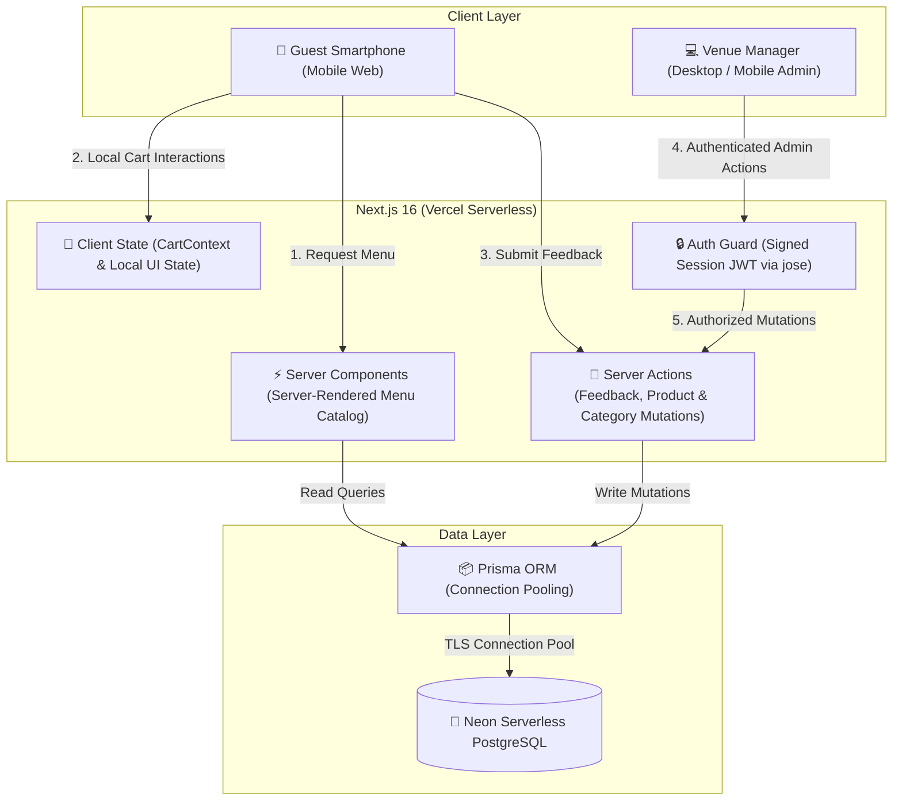
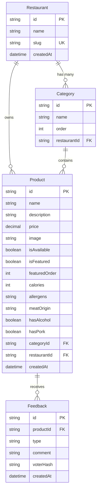

<div align="center">

# 🍽️ Premium QR Menu SaaS
### Full-Stack QR Menu & Restaurant Management Platform

A full-stack SaaS application for digital restaurant menus, product management, customer feedback, dynamic QR generation, and operational analytics. Built with **Next.js 16**, **React 19**, **TypeScript**, **Tailwind CSS v4**, **Prisma 6**, and **Neon PostgreSQL**.

[](https://nextjs.org/)
[](https://react.dev/)
[](https://www.typescriptlang.org/)
[](https://tailwindcss.com/)
[](https://www.prisma.io/)
[](https://neon.tech/)
[](https://qr-menu-delta-weld.vercel.app)

<br />

[🚀 **Explore Live Customer Menu**](https://qr-menu-delta-weld.vercel.app) &nbsp;•&nbsp;
[⚡ **View Admin Portal Showcase**](#-admin-management-portal) &nbsp;•&nbsp;
[🏛️ **System Architecture Document**](docs/architecture/system_architecture.md)

</div>

---

> [!NOTE]
> **Portfolio Showcase & Architecture Case Study**  
> The production source code is maintained in a private repository. This public repository documents the system architecture, product functionality, engineering decisions, and visual flows for portfolio and technical interview review.

---

## 📱 Live Visual Showcase

Experience both sides of the platform: the customer's mobile ordering flow and the venue manager's administrative dashboard.

<div align="center">
  <table>
    <tr>
      <th align="center" width="50%">
        <h3>📱 Customer Experience</h3>
        <p><em>Dark mode, chef's highlights, food modal & drawer cart</em></p>
      </th>
      <th align="center" width="50%">
        <h3 id="-admin-management-portal">⚡ Admin Management Portal</h3>
        <p><em>Real-time analytics, category reordering & QR generator</em></p>
      </th>
    </tr>
    <tr>
      <td align="center" valign="top">
        
        <br /><br />
        <a href="https://qr-menu-delta-weld.vercel.app"><strong>🔗 Launch Customer Menu</strong></a>
      </td>
      <td align="center" valign="top">
        
        <br /><br />
        <em>Admin mutations are protected by session authentication. See feature gallery below for full walkthrough.</em>
      </td>
    </tr>
  </table>
</div>

---

## 👨‍💻 My Role

This project was designed, architected, and built entirely by **Eren Toksöz** as an independent full-stack development effort. Key areas of ownership:

- **Frontend & Mobile UX**: Engineered a mobile-first responsive interface with persistent dark/light theme switching (`next-themes`), sticky category scroll tracking, and a client-side slide-over cart drawer.
- **Server Architecture**: Implemented Next.js App Router architecture, leveraging React Server Components for data fetching and Server Actions for mutations and feedback collection.
- **Data Modeling & Storage**: Designed the relational PostgreSQL schema using Prisma ORM, implementing relational cascades, category order indexing, and connection pooling on Neon Serverless.
- **Authentication & Security**: Built session-based route and mutation guards using signed HS256 JWT tokens stored in HTTP-only cookies via `jose`.
- **Operations & Validation**: Configured Vercel continuous deployment and authored automated Playwright headless verification scripts to validate core customer and admin journeys.

---

## 💡 Key Engineering Decisions & Challenges

### 1. Server vs. Client Rendering Boundaries
Customer menu pages use **React Server Components (RSC)** to fetch categories and products directly on the server, eliminating client-side data fetching waterfalls and reducing the JavaScript bundle sent to mobile devices. Interactive capabilities—such as the cart drawer (`CartContext`), category selector tabs, and theme toggling—are scoped to lightweight Client Components at the leaves of the render tree.

### 2. Spam-Resistant Feedback Without Mandatory Login
To capture guest feedback without forcing customers to create an account, the `submitFeedback` Server Action computes a composite SHA-256 fingerprint from the client's IP, User-Agent, and the targeted product ID. A 6-hour rate-limiting window prevents duplicate ballot stuffing while returning an idempotent response to preserve a friction-free guest experience.

### 3. Relational Modeling & Manual Category Ordering
Restaurant menus require custom display order rather than simple alphabetical or timestamp sorting. The database model maintains an explicit `order` integer column on `Category`. A dedicated Server Action updates category positions atomically, enabling restaurant managers to re-prioritize seasonal or high-margin menus during service.

### 4. Client-Side Cart vs. Server-Side Mutations
The shopping cart operates entirely in client-side memory through React Context (`CartContext`), enabling instant quantity adjustments and total price recalculations without network latency. Server-side communication is reserved for state mutations requiring database persistence (such as product feedback and admin CRUD operations).

---

## 🏛️ System Architecture

A modular full-stack architecture separating client presentation, server-side orchestration, and serverless relational persistence. Detailed documentation is available in [docs/architecture/system_architecture.md](docs/architecture/system_architecture.md).



---

## 🗄️ Relational Database Schema

The database model is normalized around restaurant tenancy, ordered categories, product metadata, and customer feedback:



---

## ✨ Core Product Capabilities

### 🍽️ Customer-Facing Application
- **Mobile-First Menu Browsing**: Responsive interface with sticky category navigation that follows the user's scroll position.
- **Theme Switching**: Dark and light mode toggle powered by `next-themes` with persistent state across visits.
- **Slide-Over Cart Drawer**: Client-side cart supporting instant quantity increments, item removal, and total price calculation.
- **Featured Items Carousel**: Horizontal touch-enabled showcase for signature dishes and chef's recommendations.
- **Friction-Free Feedback**: Like/Dislike ratings with optional comments, rate-limited via device fingerprinting.

### 🥗 Food Information & Transparency Features
Designed with awareness of Turkish digital restaurant menu guidelines (Tarım ve Orman Bakanlığı):
- **Per-Item Calorie Information**: Caloric values (kcal) configured per item and displayed in detail modals.
- **Allergen Indicators**: Structured badges for common dietary allergens (Gluten, Dairy, Nuts, etc.).
- **Meat Origin Sourcing**: Transparent sourcing field (Beef, Chicken, Lamb, or Non-Meat).
- **Dietary Indicators**: Visible flags for alcohol or pork presence to support guest dietary preferences.

### 📊 Business Admin Portal
- **Operational Analytics**: Overview metrics including scan frequency, daily visitor trends, and item satisfaction ratios.
- **Dynamic Category Reordering**: Drag-and-drop / sequence ordering to reorganize menu sections on demand.
- **Product Inventory Management**: Control item availability, adjust pricing, and edit nutritional disclosures in real time.
- **Table QR Code Generator**: Generate table-specific SVG/PNG QR codes configured for on-premise printing.
- **Session-Based Authentication**: Protected admin routes with signed HS256 session cookies.

---

## 📸 Feature Gallery

<div align="center">
  <table>
    <tr>
      <th align="center" colspan="2"><h3>🖥️ Administrative Dashboard & Controls</h3></th>
    </tr>
    <tr>
      <td align="center" width="50%">
        
        <br />
        <strong>Operational Overview & Traffic Trends</strong>
      </td>
      <td align="center" width="50%">
        
        <br />
        <strong>Product Catalog & Inventory Controls</strong>
      </td>
    </tr>
    <tr>
      <th align="center" colspan="2"><h3>📱 Mobile Guest & Administrative Flows</h3></th>
    </tr>
    <tr>
      <td align="center" width="50%">
        
        <br />
        <strong>Transparency Modal (Calories, Allergens, Sourcing)</strong>
      </td>
      <td align="center" width="50%">
        
        <br />
        <strong>Client-Side Slide-Over Cart</strong>
      </td>
    </tr>
    <tr>
      <td align="center" width="50%">
        
        <br />
        <strong>Dynamic Category Ordering Interface</strong>
      </td>
      <td align="center" width="50%">
        
        <br />
        <strong>Table QR Code Generation Engine</strong>
      </td>
    </tr>
  </table>
</div>

---

## 🛠️ Technology Stack & Engineering Rationale

| Layer | Technology | Engineering Rationale |
| :--- | :--- | :--- |
| **Framework** | [Next.js 16](https://nextjs.org/) | App Router architecture; Server Components for server-rendered menu data and Server Actions for data mutations |
| **UI Library** | [React 19](https://react.dev/) | Utilizing React 19 concurrent features, transitions, and component-level state |
| **Language** | [TypeScript 5](https://www.typescriptlang.org/) | Static type safety spanning database models, server action contracts, and UI components |
| **Styling** | [Tailwind CSS v4](https://tailwindcss.com/) | Utility-first CSS engine enabling responsive layouts, CSS variables, and native dark mode |
| **Database** | [Neon PostgreSQL](https://neon.tech/) | Serverless PostgreSQL with managed connection pooling suited for serverless execution |
| **ORM** | [Prisma 6](https://www.prisma.io/) | Type-safe query building, automated migrations, and schema modeling |
| **Authentication** | [jose](https://github.com/panva/jose) | Edge-compatible JWT signing and verification for HTTP-only session cookies |
| **Notifications** | [Sonner](https://sonner.emilkowal.ski/) | Lightweight toast notifications for user action feedback |
| **Icons** | [Lucide React](https://lucide.dev/) | Consistent, accessible icon set with tree-shaking support |
| **Deployment** | [Vercel](https://vercel.com/) | Continuous deployment pipeline with serverless compute and global asset distribution |

---

## 📊 Project Status & Testing

- **Current Status**: `Completed / Portfolio-Ready / Independently Developed`
- **Quality & Verification**:
  - User journeys validated via headless **Playwright** browser automation scripts and cross-device mobile testing.
  - End-to-end flows tested across dark and light themes, touch viewports, and varied network latency conditions.
  - *Engineering Roadmap*: Integration of automated unit test suites (Jest/Vitest) and CI pipeline checks is planned as the next milestone.

---

## 📁 Repository Structure

```
premium-qr-menu-showcase/
├── README.md                           # Project case study & technical overview
└── docs/
    ├── architecture/
    │   └── system_architecture.md      # Deep-dive architecture & data flow documentation
    ├── demo/
    │   ├── customer-flow.gif           # Optimized mobile customer flow animation (~5 MB)
    │   └── admin-showcase.gif          # Optimized admin dashboard flow animation (~3 MB)
    └── screenshots/                    # High-resolution desktop and mobile UI captures
```

---

## 👨‍💻 About the Developer

**Eren Toksöz** — Software Engineer  
Open to Software Engineering, Full-Stack, and Frontend Development opportunities in Türkiye and remote international teams.

- **GitHub**: [@ErenTzz](https://github.com/ErenTzz)
- **LinkedIn**: [linkedin.com/in/erentoksoz](https://www.linkedin.com/in/erentoksoz)
- **Live Demo**: [qr-menu-delta-weld.vercel.app](https://qr-menu-delta-weld.vercel.app)

*Commercial inquiries regarding custom hospitality implementations or platform licensing are welcome via LinkedIn or email.*

---

<div align="center">
  <sub>Copyright © 2026 Eren Toksöz. All Rights Reserved. Prepared for portfolio review and technical evaluation.</sub>
</div>
