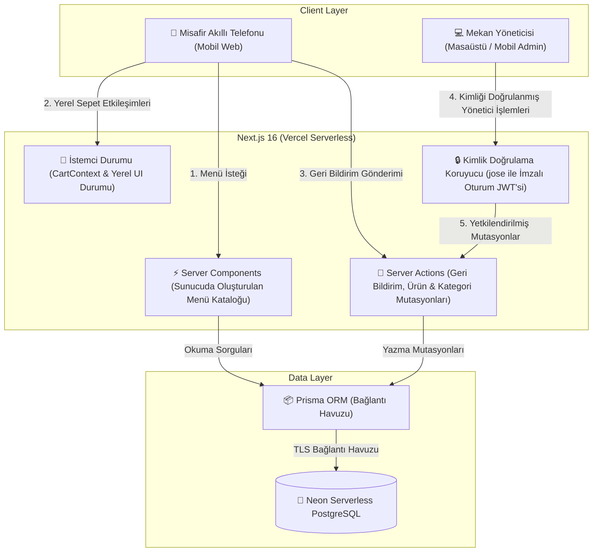
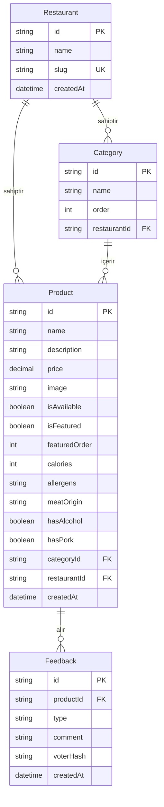
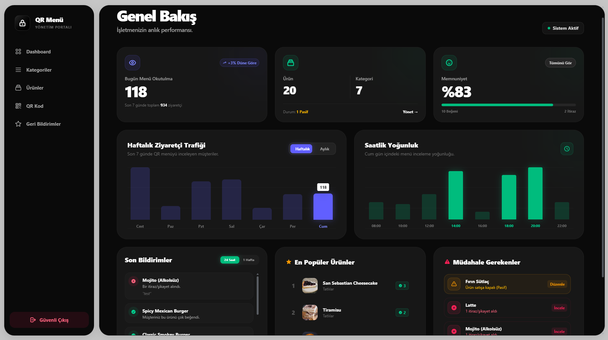
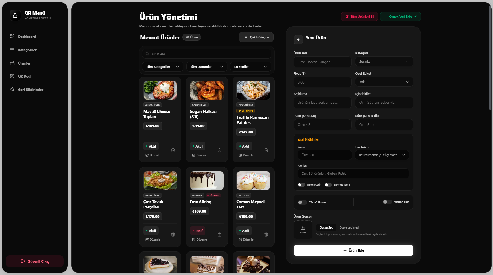
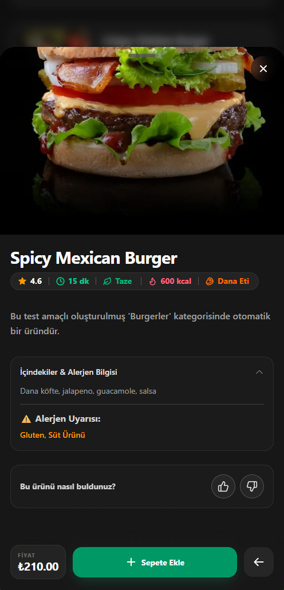
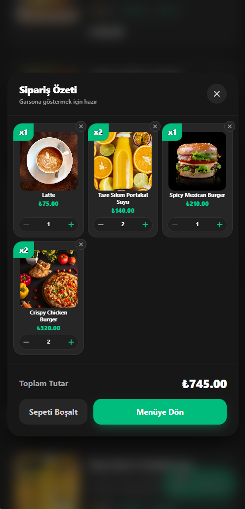
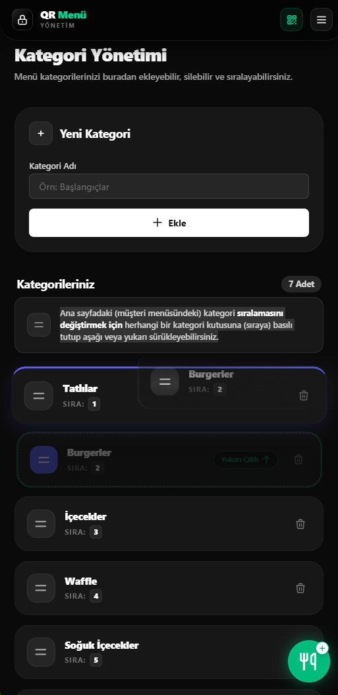
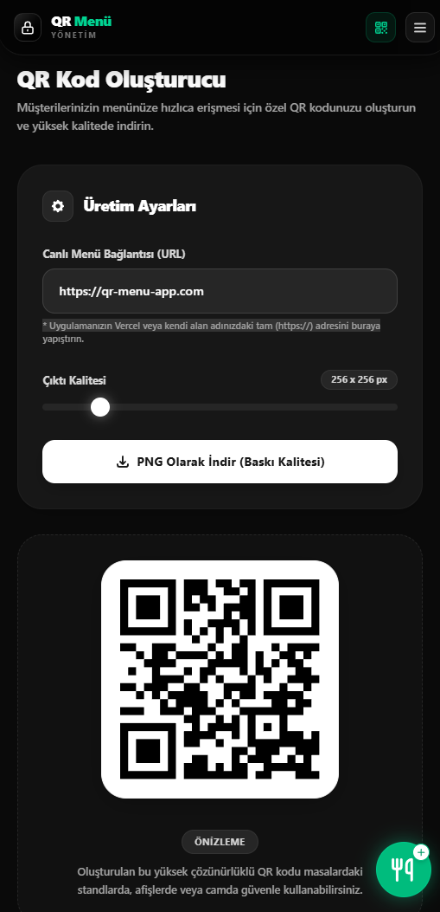

<div align="center">

[](README.tr.md)
[](README.md)

# 🍽️ Premium QR Menü SaaS
### Full-Stack QR Menü & Restoran Yönetim Platformu

Dijital restoran menüleri, ürün yönetimi, müşteri geri bildirimleri, dinamik QR oluşturma ve operasyonel analitik için full-stack SaaS uygulaması. **Next.js 16**, **React 19**, **TypeScript**, **Tailwind CSS v4**, **Prisma 6**, ve **Neon PostgreSQL** ile geliştirilmiştir.

[](https://nextjs.org/)
[](https://react.dev/)
[](https://www.typescriptlang.org/)
[](https://tailwindcss.com/)
[](https://www.prisma.io/)
[](https://neon.tech/)
[](https://qr-menu-delta-weld.vercel.app)

<br />

[🚀 **Canlı Müşteri Menüsünü İncele**](https://qr-menu-delta-weld.vercel.app) &nbsp;•&nbsp;
[⚡ **Yönetici Panelini Görüntüle**](#-yönetim-paneli-admin) &nbsp;•&nbsp;
[🏛️ **Sistem Mimarisi Belgesi**](docs/architecture/system_architecture.md)

</div>

---

> [!NOTE]
> **Portfolyo Sunumu & Mimari İncelemesi**  
> Üretim (production) kaynak kodu gizli bir depoda (private repository) tutulmaktadır. Bu açık depo, portfolyo ve teknik mülakat değerlendirmeleri için sistem mimarisini, ürün işlevselliğini, mühendislik kararlarını ve görsel akışları belgelemektedir.

---

## 📱 Canlı Görsel Sunum

Platformun her iki tarafını da deneyimleyin: müşterinin mobil sipariş akışı ve mekan yöneticisinin idari paneli.

<div align="center">
  <table>
    <tr>
      <th align="center" width="50%">
        <h3>📱 Müşteri Deneyimi</h3>
        <p><em>Karanlık mod, şefin önerileri, yemek detayı & sepet çekmecesi</em></p>
      </th>
      <th align="center" width="50%">
        <h3 id="-yönetim-paneli-admin">⚡ Yönetim Paneli (Admin)</h3>
        <p><em>Gerçek zamanlı analizler, kategori sıralama & QR oluşturucu</em></p>
      </th>
    </tr>
    <tr>
      <td align="center" valign="top">
        
        <br /><br />
        <a href="https://qr-menu-delta-weld.vercel.app"><strong>🔗 Müşteri Menüsünü Başlat</strong></a>
      </td>
      <td align="center" valign="top">
        
        <br /><br />
        <em>Yönetici işlemleri oturum doğrulaması ile korunmaktadır. Tam anlatım için aşağıdaki özellik galerisine bakın.</em>
      </td>
    </tr>
  </table>
</div>

---

## 👨‍💻 Rolüm

Bu proje, tamamen **Eren Toksöz** tarafından bağımsız bir full-stack geliştirme çalışması olarak tasarlanmış, mimarisi oluşturulmuş ve inşa edilmiştir. Temel sorumluluk alanları:

- **Frontend & Mobil UX**: `next-themes` ile kalıcı karanlık/aydınlık tema geçişi, yapışkan (sticky) kategori kaydırma takibi ve istemci tarafı (client-side) yandan açılan sepet çekmecesi ile mobil öncelikli duyarlı bir arayüz geliştirildi.
- **Sunucu Mimarisi**: Next.js App Router mimarisi kurularak, veri çekme işlemleri için React Server Components, mutasyonlar ve geri bildirim toplamak için Server Actions kullanıldı.
- **Veri Modelleme & Depolama**: Prisma ORM kullanılarak ilişkisel PostgreSQL şeması tasarlandı; ilişkisel silme (cascade), kategori sıralama indeksleme ve Neon Serverless üzerinde bağlantı havuzlama (connection pooling) uygulandı.
- **Kimlik Doğrulama & Güvenlik**: HTTP-only çerezlerde `jose` aracılığıyla saklanan imzalı HS256 JWT token'ları kullanılarak oturum tabanlı rota ve mutasyon korumaları oluşturuldu.
- **Operasyonlar & Doğrulama**: Vercel sürekli dağıtım (CI/CD) yapılandırıldı ve temel müşteri/yönetici yolculuklarını doğrulamak için Playwright ile otomatik headless (görünmez tarayıcı) doğrulama betikleri yazıldı.

---

## 💡 Temel Mühendislik Kararları & Zorluklar

### 1. Sunucu ve İstemci Render Sınırları (Server vs. Client Rendering Boundaries)
Müşteri menüsü sayfaları, kategori ve ürünleri doğrudan sunucuda çekmek için **React Server Components (RSC)** kullanır. Bu sayede istemci tarafında veri çekme şelaleleri (waterfalls) önlenir ve mobil cihazlara gönderilen JavaScript boyutu azaltılır. Etkileşimli özellikler (sepet çekmecesi `CartContext`, kategori seçici sekmeler ve tema geçişi vb.) render ağacının uçlarındaki hafif İstemci Bileşenleri (Client Components) ile sınırlandırılmıştır.

### 2. Zorunlu Giriş Gerektirmeyen Spam Korumalı Geri Bildirim
Müşterileri hesap açmaya zorlamadan geri bildirim almak için, `submitFeedback` Server Action; istemcinin IP'si, User-Agent bilgisi ve hedeflenen ürün ID'sinden oluşan karma (composite) bir SHA-256 parmak izi hesaplar. 6 saatlik hız sınırlama (rate-limiting) penceresi, mükerrer oy kullanımını engellerken, sorunsuz bir misafir deneyimi sağlamak için idempotent (etkisi değişmeyen) bir yanıt döner.

### 3. İlişkisel Modelleme & Manuel Kategori Sıralaması
Restoran menüleri, basit alfabetik veya zaman damgalı sıralamadan ziyade özel bir görüntüleme sırası gerektirir. Veritabanı modeli, `Category` üzerinde açık bir `order` tam sayı sütunu barındırır. Özel bir Server Action, kategori pozisyonlarını atomik olarak güncelleyerek restoran yöneticilerinin servis sırasında mevsimsel veya yüksek kârlı menüleri yeniden önceliklendirmesine olanak tanır.

### 4. İstemci Tarafı Sepet ve Sunucu Tarafı Mutasyonlar
Alışveriş sepeti, ağ gecikmesi olmaksızın anında miktar ayarlamaları ve toplam fiyat hesaplamaları sağlamak için tamamen React Context (`CartContext`) üzerinden istemci tarafı belleğinde çalışır. Sunucu tarafı iletişim, yalnızca veritabanı kalıcılığı gerektiren durum mutasyonlarına (ürün geri bildirimi ve admin CRUD işlemleri gibi) ayrılmıştır.

---

## 🏛️ Sistem Mimarisi

İstemci sunumu, sunucu tarafı orkestrasyon ve sunucusuz ilişkisel kalıcılığı ayıran modüler bir full-stack mimari. Detaylı belgelendirme [docs/architecture/system_architecture.md](docs/architecture/system_architecture.md) adresinde mevcuttur.



---

## 🗄️ İlişkisel Veritabanı Şeması

Veritabanı modeli; restoran kiracılığı (tenancy), sıralı kategoriler, ürün meta verileri ve müşteri geri bildirimleri etrafında normalize edilmiştir:



---

## ✨ Temel Ürün Yetenekleri

### 🍽️ Müşteri Odaklı Uygulama
- **Mobil Öncelikli Menü Gezintisi**: Kullanıcının kaydırma pozisyonunu takip eden yapışkan kategori navigasyonuna sahip duyarlı arayüz.
- **Tema Geçişi**: `next-themes` ile desteklenen ve ziyaretler arasında kalıcı olan karanlık ve aydınlık mod geçişi.
- **Yandan Açılan Sepet (Slide-Over Cart)**: Anında miktar artırma, ürün çıkarma ve toplam fiyat hesaplamayı destekleyen istemci tarafı sepet.
- **Öne Çıkan Ürünler Karuseli (Carousel)**: İmza yemekler ve şefin önerileri için dokunmatik destekli yatay vitrin.
- **Sorunsuz Geri Bildirim**: Cihaz parmak izi ile hız sınırlandırması yapılmış, isteğe bağlı yorum içeren Beğen/Beğenme derecelendirmeleri.

### 🥗 Gıda Bilgisi & Şeffaflık Özellikleri
Türkiye'nin dijital restoran menü yönergeleri (Tarım ve Orman Bakanlığı) dikkate alınarak tasarlanmıştır:
- **Ürün Başına Kalori Bilgisi**: Her ürün için yapılandırılan ve detay modallarında gösterilen kalori (kcal) değerleri.
- **Alerjen Göstergeleri**: Yaygın diyet alerjenleri (Gluten, Süt Ürünleri, Kuruyemiş vb.) için yapılandırılmış rozetler.
- **Et Menşei Kaynağı**: Şeffaf kaynak alanı (Dana, Tavuk, Kuzu veya Etsiz).
- **Diyet Göstergeleri**: Misafirlerin diyet tercihlerini desteklemek için alkol veya domuz eti varlığını belirten görünür işaretler.

### 📊 İşletme Yönetim Paneli
- **Operasyonel Analitikler**: Tarama sıklığı, günlük ziyaretçi trendleri ve ürün memnuniyet oranlarını içeren genel bakış metrikleri.
- **Dinamik Kategori Sıralama**: Menü bölümlerini isteğe göre yeniden düzenlemek için sürükle-bırak / sıralama özelliği.
- **Ürün Envanter Yönetimi**: Ürün stok durumunu kontrol etme, fiyatlandırmayı ayarlama ve besin bilgilerini gerçek zamanlı düzenleme.
- **Masa QR Kod Oluşturucu**: Mekanda yazdırılmak üzere yapılandırılmış masaya özel SVG/PNG QR kodları oluşturma.
- **Oturum Tabanlı Kimlik Doğrulama**: İmzalı HS256 oturum çerezleri ile korunan yönetici rotaları.

---

## 📸 Özellik Galerisi

<div align="center">
  <table>
    <tr>
      <th align="center" colspan="2"><h3>🖥️ Yönetim Paneli & Kontroller</h3></th>
    </tr>
    <tr>
      <td align="center" width="50%">
        
        <br />
        <strong>Operasyonel Genel Bakış & Trafik Trendleri</strong>
      </td>
      <td align="center" width="50%">
        
        <br />
        <strong>Ürün Kataloğu & Envanter Kontrolleri</strong>
      </td>
    </tr>
    <tr>
      <th align="center" colspan="2"><h3>📱 Mobil Misafir & Yönetim Akışları</h3></th>
    </tr>
    <tr>
      <td align="center" width="50%">
        
        <br />
        <strong>Şeffaflık Modalı (Kalori, Alerjenler, Kaynak)</strong>
      </td>
      <td align="center" width="50%">
        
        <br />
        <strong>İstemci Tarafı Yandan Açılan Sepet</strong>
      </td>
    </tr>
    <tr>
      <td align="center" width="50%">
        
        <br />
        <strong>Dinamik Kategori Sıralama Arayüzü</strong>
      </td>
      <td align="center" width="50%">
        
        <br />
        <strong>Masa QR Kod Oluşturma Motoru</strong>
      </td>
    </tr>
  </table>
</div>

---

## 🛠️ Teknoloji Yığını & Mühendislik Gerekçesi

| Katman | Teknoloji | Mühendislik Gerekçesi |
| :--- | :--- | :--- |
| **Framework** | [Next.js 16](https://nextjs.org/) | App Router mimarisi; sunucuda oluşturulan menü verileri için Server Components ve veri mutasyonları için Server Actions |
| **UI Kütüphanesi** | [React 19](https://react.dev/) | React 19 eşzamanlı (concurrent) özellikleri, transition'ları ve bileşen seviyesi durumu kullanıldı |
| **Dil** | [TypeScript 5](https://www.typescriptlang.org/) | Veritabanı modellerini, server action sözleşmelerini ve UI bileşenlerini kapsayan statik tip güvenliği |
| **Stil (Styling)** | [Tailwind CSS v4](https://tailwindcss.com/) | Duyarlı düzenler, CSS değişkenleri ve yerel karanlık mod sağlayan utility-first CSS motoru |
| **Veritabanı** | [Neon PostgreSQL](https://neon.tech/) | Sunucusuz yürütmeye uygun, yönetilen bağlantı havuzuna sahip Serverless PostgreSQL |
| **ORM** | [Prisma 6](https://www.prisma.io/) | Tip güvenli sorgu oluşturma, otomatik migrasyonlar ve şema modelleme |
| **Kimlik Doğrulama**| [jose](https://github.com/panva/jose) | HTTP-only oturum çerezleri için Edge uyumlu JWT imzalama ve doğrulama |
| **Bildirimler** | [Sonner](https://sonner.emilkowal.ski/) | Kullanıcı işlem geri bildirimleri için hafif toast bildirimleri |
| **İkonlar** | [Lucide React](https://lucide.dev/) | Tree-shaking desteğine sahip, tutarlı, erişilebilir ikon seti |
| **Dağıtım (Deploy)** | [Vercel](https://vercel.com/) | Sunucusuz bilgi işlem ve küresel varlık (asset) dağıtımı ile sürekli dağıtım (CI/CD) ardışık düzeni |

---

## 📊 Proje Durumu & Test Süreci

- **Mevcut Durum**: `Tamamlandı / Portfolyo İçin Hazır / Bağımsız Olarak Geliştirildi`
- **Kalite & Doğrulama**:
  - Kullanıcı yolculukları (user journeys), headless **Playwright** tarayıcı otomasyon betikleri ve çapraz cihaz mobil testleri ile doğrulandı.
  - Uçtan uca akışlar karanlık ve aydınlık temalarda, dokunmatik ekranlarda ve çeşitli ağ gecikme (latency) koşullarında test edildi.
  - *Mühendislik Yol Haritası*: Bir sonraki aşamada otomatik birim test süitlerinin (Jest/Vitest) ve CI pipeline kontrollerinin entegrasyonu planlanmaktadır.

---

## 📁 Depo Yapısı

```
premium-qr-menu-showcase/
├── README.md
├── README.tr.md
└── docs/
    ├── architecture/
    │   └── system_architecture.md
    ├── demo/
    │   ├── customer-flow.gif
    │   └── admin-showcase.gif
    └── screenshots/
```

---

## 👨‍💻 Geliştirici Hakkında

**Eren Toksöz** — Yazılım Mühendisi  
Türkiye'de ve uzak (remote) uluslararası ekiplerde Yazılım Mühendisliği, Full-Stack ve Frontend Geliştirme fırsatlarına açıktır.

- **GitHub**: [@ErenTzz](https://github.com/ErenTzz)
- **LinkedIn**: [Eren Toksöz](https://www.linkedin.com/in/eren-toksoz-094331186/)
- **Canlı Demo**: [qr-menu-delta-weld.vercel.app](https://qr-menu-delta-weld.vercel.app)

*Özel konaklama/restoran uygulamaları veya platform lisanslaması ile ilgili ticari sorularınız için LinkedIn veya e-posta yoluyla iletişime geçebilirsiniz.*

---

<div align="center">
  <sub>Telif Hakkı © 2026 Eren Toksöz. Tüm Hakları Saklıdır. Portfolyo incelemesi ve teknik değerlendirme için hazırlanmıştır.</sub>
</div>
