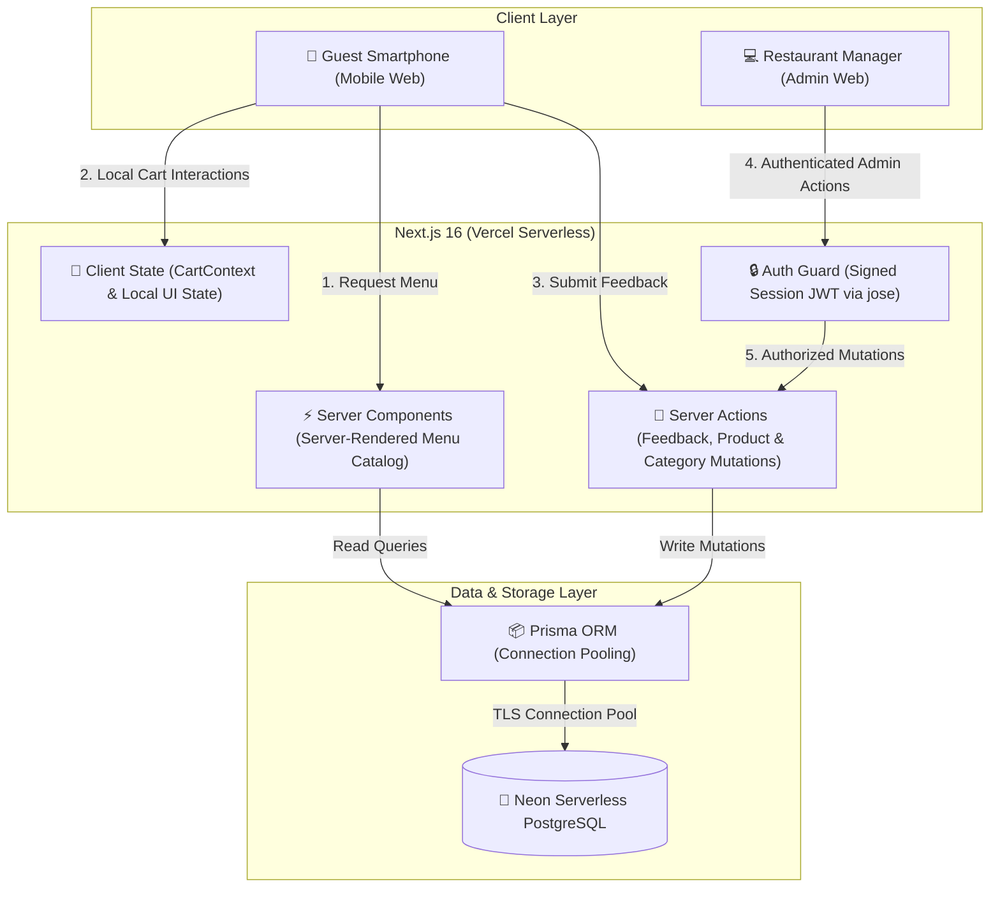
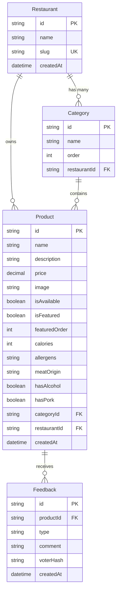

# 🏛️ System Architecture & Engineering Breakdown

This document provides a technical overview of the architecture, database schema, data flows, and engineering trade-offs behind the **Premium QR Menu SaaS** platform.

---

## 1. High-Level Architecture

The platform follows a modern full-stack architecture built on **Next.js 16 (App Router)** and **React 19**, deployed on **Vercel Serverless**, backed by **Neon Serverless PostgreSQL** via **Prisma ORM**.

---

## 2. Relational Database Schema

The database model is normalized to support multi-tenant restaurant data, hierarchical categories with custom display ordering, product nutritional metadata, and rate-limited customer feedback:

---

## 3. Key Architectural Pillars & Engineering Trade-Offs

### A. Server Components vs. Client-Side Rendering
- **Server Components (RSC)**: Used for initial page loading and category/product fetching. The server renders complete semantic HTML, drastically reducing client-side JavaScript execution on lower-end mobile devices and spotty cellular networks.
- **Client Components**: Deliberately restricted to leaf-level interactive nodes:
  - Theme toggler (`next-themes`)
  - Cart drawer and quantity modifiers (`CartContext`)
  - Dish detail modals with interactive feedback triggers
  - Admin drag-and-drop category sorting

### B. Client-Side Cart State Isolation
The shopping cart intentionally avoids server round-trips:
- Cart items and quantities are managed purely in client memory (`CartContext`).
- Price calculations and quantity increments occur instantaneously with zero network overhead.
- State persistence across reloads can be handled via browser storage without polluting the database with abandoned cart rows.

### C. Spam-Resistant Feedback Without Authentication Barriers
Requiring customer accounts for menu ratings creates heavy friction that discourages usage. Instead:
- When a guest submits a Like or Dislike rating, a non-invasive SHA-256 composite hash (`voterHash`) is computed:
  $$\text{voterHash} = \text{SHA256}(\text{IP} + \text{UserAgent} + \text{ProductID})$$
- The server checks for existing ratings from that fingerprint within a 6-hour window.
- Repeat votes are silently acknowledged without writing duplicate records, reducing duplicate voting and casual abuse while maintaining a frictionless user experience.

### D. Food Information & Transparency Features
The product schema and UI supports food-information and transparency fields relevant to restaurant menus:
- **Per-Item Calorie Information (`calories`)**: Caloric value (kcal) per serving.
- **Allergen Disclosures (`allergens`)**: Structured tags for common dietary allergens (Gluten, Dairy, Nuts, etc.).
- **Meat Origin Sourcing (`meatOrigin`)**: Sourcing transparency (Beef, Chicken, Lamb, or Non-Meat).
- **Dietary Indicators (`hasAlcohol`, `hasPork`)**: Automated UI badges to assist guests with specific dietary preferences.

### E. Session-Based Administrative Security
- Administrative mutations enforce server-side validation via `requireAuth()`.
- Authentication state is encapsulated in a signed HS256 JWT managed by `jose`, stored in an HTTP-only, SameSite, secure cookie.
- Decouples credentials from client-side JavaScript, reducing exposure of session tokens to client-side JavaScript.

### F. Database Connection Management
- Utilizing **Neon Serverless PostgreSQL** with built-in connection pooling.
- A global singleton pattern in `lib/prisma.ts` prevents connection exhaustion during development hot-reloads and handles serverless container lifecycles efficiently.
